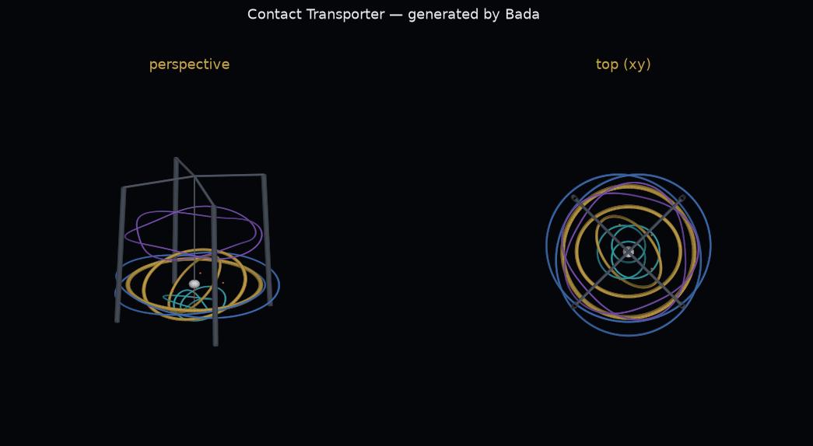

# contact_transporter — 『コンタクト』型 異次元輸送機の 3 次元設計図 (Bada)

添付された 15 本の論文に載っている方程式をすべて抽出し、量子プログラミング言語 **Bada**
(実行可能な C 実装 `../bada_c` の方言) で 1 本の設計図生成プログラムにまとめたものです。

```sh
cd contact_transporter
./build.sh             # 結合 → 実行 → contact_machine.obj / contact_blueprint.txt を出力
./build.sh --native    # さらにネイティブ実行形式 ./contact_blueprint を生成
./build.sh --regen     # catalog/ から方程式レジストリ equations.bada を再生成してから実行
python3 tools/render_obj.py contact_machine.obj preview.png   # プレビュー画像 (要 matplotlib)
```

## 結果 (現在のカタログ)

- 論文 15 本 → 方程式 **2111 本** を登録 (catalog/eq_A〜D.md)
  - 数値評価 **632 本** (うち等式・不等式の数値検証 412 本: 成立 231 / 不成立 181)
  - 記号的な式 1479 本 (設計図部品への構造的割り当て)
- 実行時間: 約 17 秒 (`bada_c` インタプリタ)。出力: `contact_machine.obj` (頂点 16,760), `contact_blueprint.txt`, `preview.png`



## パイプライン (`main_blueprint.bada`)

| 段 | 内容 | 主な式 |
|:--|:--|:--|
| ① 衝突段 | ジュネーブ CERN の加速器系 (線形加速器 Linac4 → PSB → PS → SPS → LHC) の √s = 13.6 TeV pp 衝突を決定論的に模擬。**粒子が消えた方向** = 消失運動量 −Σp を「異次元への扉の軸」にする | E_T^miss = \|Σp_T\| |
| ② 特殊相対論 | 映画『コンタクト』: 地球の 1 秒 ↔ 搭乗者の 18 時間。比 Γ = 64800 をローレンツ因子とし、ベガ (25.04 ly) の収縮距離・片道時間を計算 | γ = 1/√(1−β²), φ = arcosh γ, L' = L/γ |
| ②' 輸送計量 | system_transport の「次元の回転は他の次元への輸送」: 計量 ds² = e^{−2πT\|ψ\|}[η+h̄]dx^μdx^ν + T²dψ² のワープ因子を 1/Γ に一致させる | T\|ψ\| = ln Γ / 2π |
| ③ 複素回転体 (コマ) | ブースト = 虚角回転 (cos iφ = cosh φ = γ)。コマの章動角を複素角 Θ = θ + iφ に拡張し、3 環ジンバルの角速度・歳差・章動・Thomas 歳差を決定 | Ω = Mgl/(I₃ω₃), ω_T = γ²/(γ+1)·av/c² |
| ④ Γ・ζ 大域的部分積分多様体 | 複素 Γ (Lanczos)、複素 ζ (Borwein + 関数等式)、Riemann–Siegel θ と Z(t)、部分積分 ∫x^{s−1}e^{−x}dx = Γ(s)、ボース積分 Γ(s)ζ(s) | Z(t) = e^{iθ(t)}ζ(½+it) ∈ ℝ |
| ⑤ Jones 多項式 = 設計図生成機能 | Kauffman ブラケット状態和で 3_1, 4_1, 5_1 の V(t) を計算し、t* = e^{iθ(φ)} で評価。\|V\|→コイル寸法、\|V(e^{iα})\| の極小→扉の共鳴窓 | V(t) = (−A³)^{−w}⟨K⟩, A = t^{−1/4} |
| ⑥ 全方程式レジストリ | 論文の全方程式を登録。数値化できる式は実際に計算し、等式は両辺を数値検証 (成立/不成立を正直に表示)。各式はタグで設計図の部品に割り当てられ、数値エネルギー Σlog(1+\|v\|) が部品寸法を変調 | `equations.bada` |
| ⑦ 3D 設計図 | 3 重ジンバル環・ポッド・4 本の塔とガントリー・投下シャフト・Jones 結び目コイル (T(2,3), T(2,5), 8 の字)・扉の軸・共鳴窓を Wavefront OBJ に出力。端末には ASCII 上面図/正面図 | `contact_machine.obj` |

## ファイル

| ファイル | 内容 |
|:--|:--|
| `lib_core.bada` | 複素数、複素 Γ・ζ、特殊相対論、コマの回転、Kauffman ブラケット / Jones 多項式 |
| `lib_geom.bada` | ベクトル・Rodrigues 回転・トーラス/球/円柱/管/結び目メッシュ・OBJ 出力 |
| `lib_physics.bada` | 衝突模擬・SR ブロック・複素コマ・Riemann–Siegel・Γ/ボース積分・Jones 共鳴 |
| `lib_registry.bada` | 方程式レジストリ (`eq` / `eqs` / `chk`) と部品別集計 |
| `equations.bada` | **自動生成**: 全方程式 + 数値評価クロージャ + 補助関数 |
| `main_blueprint.bada` | 設計図生成本体 |
| `contact_blueprint.bada` | 上記を結合した単一ソース (build.sh が生成。bada_c に import が無いため) |
| `catalog/` | 論文ごとの方程式カタログ (`eq_*.md`) と数値評価式 (`calc_*.tsv`, `helpers_*.bada`) |
| `tools/` | `gen_equations.py` (レジストリ生成), `hoist_lets.py` (ループ内 `let` の巻き上げ), `render_obj.py` |

## 正直な範囲

- これは論文の式を使った**思索的・フィクションの設計図 (幾何的な可視化)** です。工学的に検証された
  装置ではなく、異次元への輸送が可能になるものではありません。
- CERN の LHC は線形加速器ではなく周長 27 km の円形衝突型加速器です。陽子は線形加速器 **Linac4**
  から入射されます。「粒子が消えた方向」は、実際の LHC の余剰次元探索 (ADD 模型の重力子が余剰次元へ
  抜けると E_T^miss として観測される) に対応させていますが、衝突は乱数による模擬です。
- 特殊相対論では運動する側の時計が遅れます。映画の「地球 1 秒 / 搭乗者 18 時間」を SR で書くため、
  ここでは「宇宙の中で回転する異次元」側から見て地球側が Γ = 64800 で運動している、とモデル化しています。
- 論文中には Jones 多項式そのものや時間の遅れの公式は明示されていません (抽出エージェントの確認)。
  そのため Jones 多項式は標準の Kauffman ブラケット状態和で、時間の遅れは標準のローレンツ因子で実装し、
  既知の値 (3_1: −t⁻⁴+t⁻³+t⁻¹, 4_1: t⁻²−t⁻¹+1−t+t², ζ(2)=π²/6, Γ(5)=24, Z(t) が実数) で検算しています。
- 論文の方程式は PDF のテキスト抽出から再構成したため、上付き・下付き文字などに推測を含みます。
  論文の等式の中には数値的に成立しないもの (例: π^e = e^π) があり、レジストリはそれを「不成立」
  として**そのまま報告**します (式を勝手に修正していません)。記号的な式 (数値化できない式) は
  計算せず、部品への構造的な割り当てのみ行います。
- T\|ψ\| = ln Γ / 2π ≈ 1.76329 は論文の x log x = 1 の根 1.76322 に近いですが、これは数値的な
  近さの記録であり、理論的な関係を主張するものではありません。
- 論文に書かれた Bada 構文 (`:=`, `{ }`, `@reviser` など) を実行できる処理系はこのリポジトリに
  無いため、実際に動く `bada_c` 方言 (`def/let/while/if/end`) で書いています。
